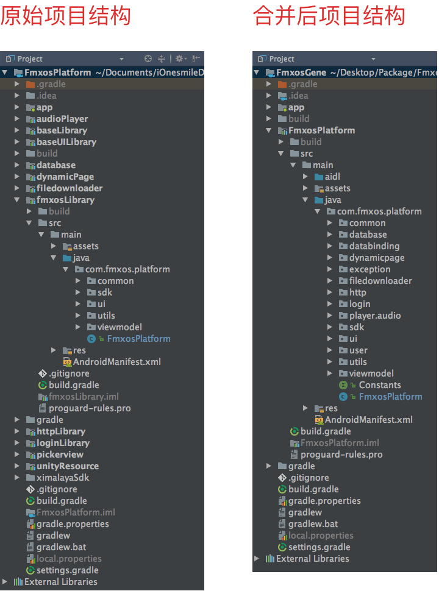

# MergeModuleAAR
A script which merging a number of android library into one module. This makes it easier to generate an AAR file.


# 合并多个库为一个 AAR 文件

近几个月在公司实现了基于喜马拉雅FM音频运营的功能模块，功能比较多，因此细分到不同库去写逻辑。如基础工具库、播放库、文件下载库、网络库等，这样在做其它项目时可以方便移植这些通用功能。为了扩充运营用户量，需要将这一功能模块打包成 SDK，便于分发到其它应用中。经研究使用 AAR 文件的形式，在其它应用集成时最方便。

Android Gradle 打包每个库工程都会导出一个 AAR 文件。之前有尝试使用第三方插件 `fat-aar` 来合并打包，但打包时经常报错，合并时间也略长。此外此次导出的 SDK 需要做代码混淆，如果对每一个库都进行混淆文件非常麻烦，不便于统一管理，也不便于统一暴露接口。工程库之间的引用逻辑比较多，也增加了导包的配置成本，此外还要支持 AIDL 合并。


#### 最终选择将多个工程库合并到一个工程库后再打包，通过写批处理程序实现。


原本打算使用 `Python` 开发，但时间较紧张没有太多踩坑机会。由于个人对 Java 的 API 比较熟悉，因此采用了可以完成兼容 Java，且语法更灵活简洁，可以直接贴多行文本避免转义符的 `Kotlin` 来实现。


## 代码实现逻辑

### 一、遍历读取需要合并的文件名

分析需要合并的文件，包含 libs/、src/main/ 和 build.gradle 文件。不需要合并的文件，例如：build/、test/ 等。

方便起见，代码中定义了需要读取文件的目录:

```kotlin
ItemFile("libs"),
ItemFile("src").addItemFile(
        ItemFile("main").addItemFile(
                ItemFile("aidl"),
                ItemFile("assets"),
                ItemFile("java"),
                ItemFile("jniLibs"),
                ItemFile("res"),
                ItemFile("AndroidManifest.xml", false)
        )
),
ItemFile("build.gradle", false)
```

当然也可以使用类似于 `.gitignore` 的方式，定义排斥的目录名来实现。


### 二、写文件

写文件逻辑比较繁琐，需要先读取资源文件和清单文件的内容提取后再合并写出。

1. `aidl/` `assets/` `java/` 等目录下的文件直接复制，不存在重复不会有冲突
2. `res/values/` 下同名文件（strings、colors、styles等）内容合并
3. AndroidManifest 合并   
	- 合并权限，过滤掉重复权限
	- 合并 <application> 标签下内容，如："meta-data", "activity", "service", "receiver", "provider"
	- 将以 `.` 开头的相对 name 替换成绝对路径   
		如：`android:name=".ui.activity.MusicPlayerActivity"` 改成 `android:name="com.fmxos.platform.ui.activity.MusicPlayerActivity"`

4. build.gradle 合并
	- 解析 android 节点下配置
	- 解析 dependencies 节点下依赖
	- 去除重复
	
	用正则表达式匹配，生成结果不是很准确，仅用于最后参考对比。


### 三、遇到的问题

1. 统一导包、`R`、`BuildConfig`
	
	由于这两个类是自动生成跟随库的包名的，每个库对应一组。合并工程后只剩下一组，之前在代码中引入的这两个文件包名现在无效。  
	  
	代码中使用正则表达式进行替换，例如： 
	
	```
	"import com.fmxos.[a-zA-Z_0-9.]*?.R;" to "import com.fmxos.platform.R;"
	```
	
	在 Android Studio 中也可以正则查找替换导包，`Shift + Command + R` ，选中匹配大小写框和正则框。


### 四、补充 DataBinding 的替换

在开发应用时为开发方便实用了 `databinding` 功能，打包后由于要移植到一个老的项目中，而那个项目的 gradle 版本还是 2.10，如果更新到 SDK 实用的 4.1 版本又会带来很多麻烦。不修改 2.10 生成目录是在应用包名下，导致 SDK 中的引用找不到生成后的 DataBinding。自己代码中虽然用到了 databinding，不过只停留在用 findViewbyId() 的功能上，想到这里就决定按照它的格式自己生成一个壳，移除 databinding 来兼容不同版本。

#### 代码实现方式

1. 通过读取 layout 文件，生成 findViewbyId() 功能的代码
	- layout/ 目录下的文件以 <layout> 标签开头的就是 databinding 文件
	- 读取文件，匹配包含 id 的标签，并生成代码

2. 移除文件中的 <layout> 标签，转移域名到下一级根目录

3. 替换导包 `ViewDataBinding` 、 `DataBindingUtil`

示例代码结构：

创建与 databinding 一样的类名和函数，用于移花接木的壳：

```java
public interface ViewDataBinding {

    View getRoot();
}

public class DataBindingUtil {

    public static <SV extends ViewDataBinding> SV inflate(LayoutInflater layoutInflater, int layoutId, Object o, boolean b) {
        if (layoutId == R.layout.fmxos_activity_base) {
            return (SV) new FmxosActivityBaseBinding(layoutInflater, layoutId);
        }
        return null;
    }
}
```

自动生成 findViewById 功能的代码，成员函数命名与 databinding 一致：

```java
public class FmxosActivityBaseBinding implements ViewDataBinding {

    private final View mRootView;
    public final android.support.v7.widget.Toolbar toolBar;

    public FmxosActivityBaseBinding(LayoutInflater layoutInflater, int layoutId) {
        mRootView = layoutInflater.inflate(layoutId, null);
        toolBar = (android.support.v7.widget.Toolbar) mRootView.findViewById(R.id.tool_bar);
    }

    @Override
    public View getRoot() {
        return mRootView;
    }
}
```


## 项目合成结构

为了方便理解，这里贴出我的项目结构。`app` 下是引用 SDK 的入口，只包含一个 MainActivity 来调用，右图 FmxosPlatform 工程是合并后的结构。




